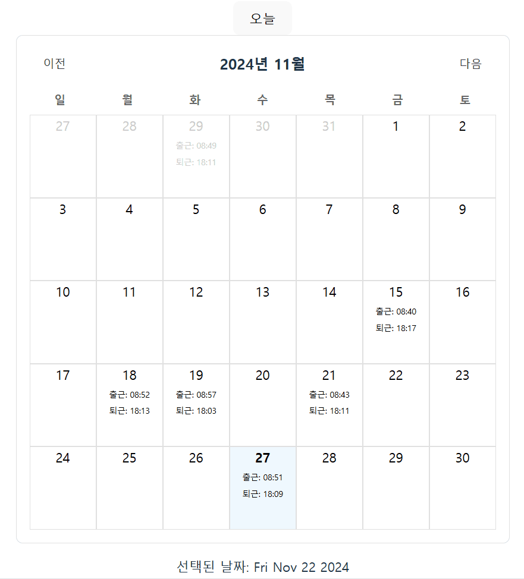

# 근태(출퇴근) 관리 달력 만들기

date-fns를 활용해 만든 근태(출퇴근) 관리 달력

### 중간 결과

중간 결과 컴포넌트는 `App.tsx`에 주석 처리 해놓았다.


### 최종 완성 결과



<br/>

## 프로젝트 생성 방법

프로젝트를 새롭게 구축하는 경우에만 참고하며 프로젝트 실행 필요시 이 단계를 건너뛴다.

### Vite 프로젝트 생성

```
npm create vite@latest
cd calendar
npm install
```

### date-fns 설치

JavaScript에서 날짜와 시간을 다루는데 매우 유용한 라이브러리이다.

```
npm i date-fns
```

<br/>

## 프로젝트 실행

### 의존성 설치

```
npm install
```

### 프로젝트 실행

```
npm run dev
```
